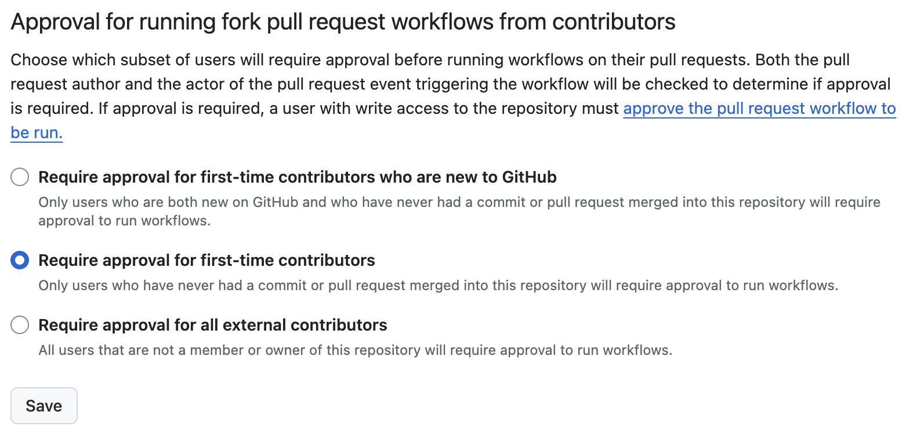
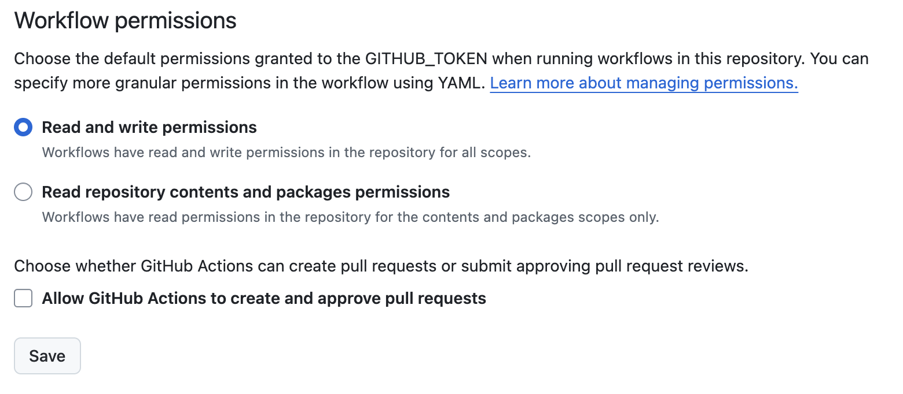
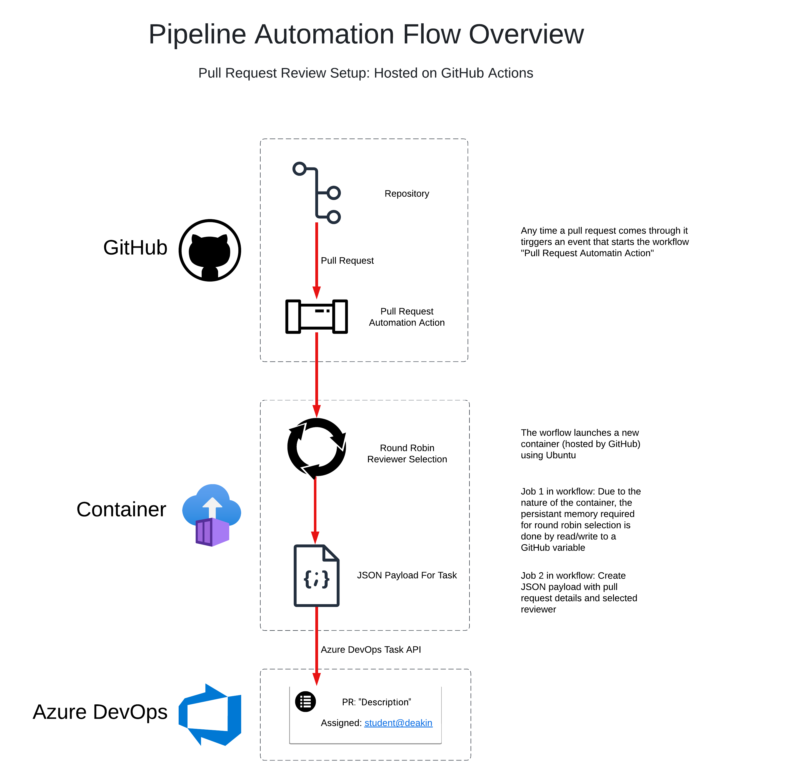

# Safety & Setup - Automatic Azure DevOps Tasks from PR's

## Safety
This workflow uses a YAML configuration file to start up an isolated Ubuntu container. The container runs both scripts contained in the "scripts" folder, however, you only need one file in your repository: PR-To-ADO.yaml.

The scripts **cannot** damage your repository. They only **get** information from pull requests. The only code that modifies anything deals with the Azure DevOps API, and even that is run with an access token that can read/write tasks. To be clear: this is a safe workflow.

## Setup
Below are visual overviews of the script/data storage and information flow for the workflow.

Note: In the flow overview diagram there is a round robin reviewer selection. This has now been removed and replaced by PR_Preferences.json. The original diagram could not be updated as the software used to create it no longer has the free trial.

### Steps to run it in your repository:

1. Create a folder named _.github/workflows_ if it does already exist.
2. Download the [file](https://github.com/Redback-Operations/redback-cyber/tree/main/.github/workflows/PR-To-ADO.yaml).
3. Move the downloaded file to your workflows folder.
4. Go to **Repository Settings >> Secrets and Variables >> Actions >> New Repository Secrete**
5. Name the secret AZUREDEVOPSPAT and paste your Azure DevOps personal access token in as the value. For more information on Azure DevOps tokens please view this [documentation](https://redback-operations.github.io/redback-documentation/docs/cybersecurity/SecDevOps%20Team/Azure%20Boards%20Technical%20Use%20Guide).
6. Now go to **Repository Settings >> Actions >> General** and ensure the following:

---

---

## Flow and Storage
---

---
